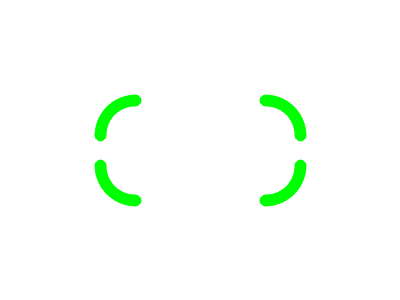

# Rounded Bounding Boxes with Arms in OpenCV

This Python script allows you to draw aesthetically pleasing **rounded bounding boxes** with **arm-like extensions** on any image using [OpenCV](https://opencv.org/). It's especially useful for highlighting objects in UI mockups, computer vision demos, or presentations.

---

## ✨ Features

* Smooth **anti-aliased rounded corners**
* **Customizable arms** extending from the edges
* Fully **parameterized**:

  * Thickness
  * Border radius
  * Arm length
  * Color
* Easy integration into your OpenCV workflows

---

## 🖼️ Example Outputs

| Example                      | Description                                |
| ---------------------------- | ------------------------------------------ |
|  | Red box with 20px radius and arms          |
|  | Thick purple frame with long arms          |
|  | Green box with large corners and no arms   |
|  | Blue box with square corners and long arms |

---

## 📦 Requirements

* Python 3.6+
* OpenCV (cv2)
* NumPy

Install dependencies via pip:

```bash
pip install opencv-python numpy
```

---

## 🚀 Usage

```python
from draw_box import draw_rounded_bounding_box
import cv2
import numpy as np

# Create blank image
img = np.ones((300, 400, 3), dtype=np.uint8) * 255

# Draw a custom box
drawn = draw_rounded_bounding_box(
    img,
    top_left=(50, 50),
    bottom_right=(350, 250),
    color=(0, 0, 255),
    thickness=3,
    border_radius=20,
    arm_length=20
)

cv2.imwrite("custom_box.png", drawn)
```

---

## 🧠 Function Signature

```python
draw_rounded_bounding_box(
    image: np.ndarray,
    top_left: Tuple[int, int],
    bottom_right: Tuple[int, int],
    color: Tuple[int, int, int],
    thickness: int = 2,
    border_radius: int = 10,
    arm_length: int = 10
) -> np.ndarray
```

| Parameter       | Description                                                       |
| --------------- | ----------------------------------------------------------------- |
| `image`         | OpenCV image (`np.ndarray`) to draw on                            |
| `top_left`      | Coordinates of top-left corner (x, y)                             |
| `bottom_right`  | Coordinates of bottom-right corner (x, y)                         |
| `color`         | RGB color tuple (B, G, R format for OpenCV)                       |
| `thickness`     | Line thickness in pixels                                          |
| `border_radius` | Radius of the rounded corners                                     |
| `arm_length`    | Length of horizontal and vertical arms extending from each corner |

---

## 📂 Files

* `draw_box.py` — Main script with function and examples
* `example_1.png` to `example_4.png` — Sample output images

---

## 🛠️ Notes

* Anti-aliasing is enabled via `cv2.LINE_AA` for smoother curves and lines.
* Corner and arm dimensions are clamped to avoid overflow beyond the box.

---

## 📄 License

MIT License

---

## 🙌 Contributing

Feel free to fork and submit PRs for enhancements or bugfixes. Ideas for improvement include:

* Support for dashed lines
* Optional labels inside or outside the box
* Batch annotation from bounding box arrays

---

## 👤 Author

**Andy Gee**
🏝️ Based in Malapascua, Philippines
🔧 [@andyg](https://github.com/andyg2)
